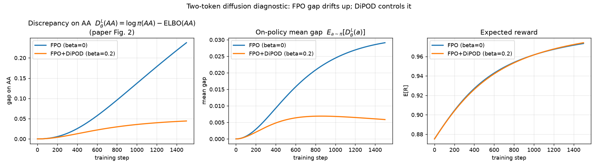

Openresearch sh autoresearch reproduction in https://github.com/manbeastfurryfreedom-ctrl/dipod-release-e361cc37/tree/orx/two-token-diffusion-diagnostic-minimal-repro-6e4dc9f9


 </img>


# DiPOD: Diffusion Policy Optimization without Drifting Apart


This release includes the language experiments from the paper and the control motion-tracking experiments used to compare original FPO++ with FPO++ initialized by self-distillation.

## Layout

- `language/SPG/`: SPG language experiments.
- `language/d1/`: d1/FPO language experiments.
- `fpo-control/`: IsaacLab/FPO++ control experiments for G1 whole-body motion tracking.


## Upstream Repositories

This release builds on the following open-source codebases:

- [amazon-far/fpo-control](https://github.com/amazon-far/fpo-control) for the control experiments.
- [facebookresearch/SPG](https://github.com/facebookresearch/SPG) for SPG language experiments.
- [dllm-reasoning/d1](https://github.com/dllm-reasoning/d1) for d1/FPO language experiments.

## Environments

Language and control experiments use separate conda environments.

### Language Environment

Use the exported language environment file:

```bash
conda env create -f language/environment.yml
conda activate dipod
```

### Control Environment

The control experiments create their own `isaaclab_fpo` environment under `fpo-control/thirdparty/`:

```bash
cd fpo-control
bash setup_env.sh
source source_env.sh
```

`setup_env.sh` installs Isaac Sim/IsaacLab dependencies and initializes the control packages. Before running tracking experiments, generate the reference motion data:

```bash
python whole_body_tracking_reference_data/download_lafan_data.py --headless
```

Run this command after `source source_env.sh` on a machine with Isaac Sim/GPU support. It downloads the LAFAN1 CSV files, runs Isaac Sim forward kinematics, and writes the required `.npz` files into `whole_body_tracking_reference_data/`.

## Language Experiments

All language experiments reported in the paper were run on a single node with 8 NVIDIA H100 GPUs. We observed that the baseline d1 and SPG codebases themselves are not exactly reproducible across different GPU types and can produce noticeably different absolute results. This hardware sensitivity is therefore not specific to DiPOD. The provided `dipod_beta=0.05` scripts match the reported setting, but this value may not show the same improvement trend on every GPU configuration; when transferring to different hardware, modest hyperparameter tuning around `0.05` may be needed to recover the qualitative gains. If reproducibility issues arise on a new hardware setup, we recommend first running the SPG and SPG+DiPOD Sudoku 3-shot experiments as a sanity check; they are the quickest language runs, and in our testing the DiPOD improvement in this setting was stable.

### FPO (`language/d1`, `dipod_beta=0`)

FPO uses the d1 code with base model sbatch scripts only. Submit these from `language/d1/diffu-grpo` so the scripts resolve their relative paths correctly:

- `language/d1/diffu-grpo/slurm_scripts/countdown_base_dipod_beta0.sbatch`
- `language/d1/diffu-grpo/slurm_scripts/gsm_base_dipod_beta0.sbatch`
- `language/d1/diffu-grpo/slurm_scripts/math_base_dipod_beta0.sbatch`
- `language/d1/diffu-grpo/slurm_scripts/sudoku_base_dipod_beta0.sbatch`

Example:

```bash
cd language/d1/diffu-grpo
sbatch slurm_scripts/gsm_base_dipod_beta0.sbatch
```

### FPO+DiPOD (`language/d1`, `dipod_beta=0.05`)

FPO+DiPOD uses the d1 code with base model sbatch scripts only. Submit these from `language/d1/diffu-grpo` so the scripts resolve their relative paths correctly:

- `language/d1/diffu-grpo/slurm_scripts/countdown_base_dipod_beta0.05.sbatch`
- `language/d1/diffu-grpo/slurm_scripts/gsm_base_dipod_beta0.05.sbatch`
- `language/d1/diffu-grpo/slurm_scripts/math_base_dipod_beta0.05.sbatch`
- `language/d1/diffu-grpo/slurm_scripts/sudoku_base_dipod_beta0.05.sbatch`

Example:

```bash
cd language/d1/diffu-grpo
sbatch slurm_scripts/gsm_base_dipod_beta0.05.sbatch
```

### SPG (`language/SPG`, `dipod_beta=0`)

Submit these from `language/SPG/spg` so the scripts resolve their relative paths correctly:

- `language/SPG/spg/slurm_scripts/spg_mix/countdown_base_spg_mix_beta1.5_weight0.5_dipod_beta0.sbatch`
- `language/SPG/spg/slurm_scripts/spg_mix/gsm_base_spg_mix_beta1.5_weight0.5_dipod_beta0.sbatch`
- `language/SPG/spg/slurm_scripts/spg_mix/math_base_spg_mix_beta1.5_weight0.5_dipod_beta0.sbatch`
- `language/SPG/spg/slurm_scripts/spg_mix/sudoku_new_base_spg_mix_beta1.0_weight0.5_dipod_beta0.sbatch`
- `language/SPG/spg/slurm_scripts/spg_mix/sudoku_new_3shot_base_spg_mix_beta1.0_weight0.5_dipod_beta0.sbatch`

Example:

```bash
cd language/SPG/spg
sbatch slurm_scripts/spg_mix/gsm_base_spg_mix_beta1.5_weight0.5_dipod_beta0.sbatch
```

### SPG+DiPOD (`language/SPG`, `dipod_beta=0.05`)

Submit these from `language/SPG/spg` so the scripts resolve their relative paths correctly:

- `language/SPG/spg/slurm_scripts/spg_mix/countdown_base_spg_mix_beta1.5_weight0.5_dipod_beta0.05.sbatch`
- `language/SPG/spg/slurm_scripts/spg_mix/gsm_base_spg_mix_beta1.5_weight0.5_dipod_beta0.05.sbatch`
- `language/SPG/spg/slurm_scripts/spg_mix/math_base_spg_mix_beta1.5_weight0.5_dipod_beta0.05.sbatch`
- `language/SPG/spg/slurm_scripts/spg_mix/sudoku_new_base_spg_mix_beta1.0_weight0.5_dipod_beta0.05.sbatch`
- `language/SPG/spg/slurm_scripts/spg_mix/sudoku_new_3shot_base_spg_mix_beta1.0_weight0.5_dipod_beta0.05.sbatch`

Example:

```bash
cd language/SPG/spg
sbatch slurm_scripts/spg_mix/gsm_base_spg_mix_beta1.5_weight0.5_dipod_beta0.05.sbatch
```

## Control: Motion Tracking

The control comparison is original FPO++ versus FPO++ with an initial self-distillation stage. The downstream FPO++ training code and task hyperparameters stay the same; self-distillation is enabled only by the `--self_distill` flags.

### Reference Motion Data

Before running tracking experiments, generate the LAFAN1 reference-motion NPZ files:

```bash
cd fpo-control
source source_env.sh
python whole_body_tracking_reference_data/download_lafan_data.py --headless
```

The script downloads the LAFAN1 CSV files, runs Isaac Sim forward kinematics, and writes the required files into `fpo-control/whole_body_tracking_reference_data/`.

Verify that the release motions exist before launching experiments:

```bash
ls whole_body_tracking_reference_data/*.npz
```

At minimum, the 1k release launcher expects these files: `dance1_subject1.npz`, `dance1_subject2.npz`, `walk1_subject1.npz`, `run1_subject2.npz`, `fight1_subject2.npz`, `jumps1_subject1.npz`, and `fallAndGetUp1_subject1.npz`. If a run fails with `AssertionError: Invalid file path: ... .npz`, this data-generation step was skipped or did not complete.

### Launch Experiments

Use `experiments/self_distillation/launch_tracking_1k.py` to launch any subset of motion-tracking tasks and either variant.

For one full baseline-vs-self-distillation comparison:

```bash
cd fpo-control
source source_env.sh
python experiments/self_distillation/launch_tracking_1k.py \
    --motions walk1 \
    --variants baseline self_distill \
    --gpus 0 1
```

For only one variant:

```bash
python experiments/self_distillation/launch_tracking_1k.py \
    --motions run1 \
    --variants self_distill \
    --gpus 0
```

For all seven release tracking tasks:

```bash
python experiments/self_distillation/launch_tracking_1k.py \
    --motions dance1_s1 dance1_s2 walk1 run1 fight1 jumps1 fallGetUp \
    --variants baseline self_distill \
    --gpus 0 1 2 3 4 5 6 7
```

Use `--dry_run` to print the exact training commands without launching Isaac Lab. When queued runs finish, the launcher calls `plot_tracking_1k.py` to refresh `experiments/self_distillation/plots_1k/`.

### Manual Commands

The launcher is a scheduler around `isaaclab_fpo/scripts/train.py`. A single baseline run is:

```bash
CUDA_VISIBLE_DEVICES=0 python isaaclab_fpo/scripts/train.py \
    --task Tracking-Flat-G1-v0 \
    --seed 42 --max_iterations 1000 --headless --device cuda:0 \
    --motion_file whole_body_tracking_reference_data/walk1_subject1.npz \
    --run_name walk1__baseline_1k
```

The matching self-distillation run is:

```bash
CUDA_VISIBLE_DEVICES=1 python isaaclab_fpo/scripts/train.py \
    --task Tracking-Flat-G1-v0 \
    --seed 42 --max_iterations 1000 --headless --device cuda:0 \
    --motion_file whole_body_tracking_reference_data/walk1_subject1.npz \
    --run_name walk1__sd_1k \
    --self_distill \
    --self_distill_iterations 100 \
    --self_distill_rollout_steps 8 \
    --self_distill_batch_size 16384 \
    --self_distill_lr 3e-4
```

### Tasks And Plots

After the 1k experiments are run, comparison plots are stored under `fpo-control/experiments/self_distillation/plots_1k/`. Prefer the individual task plots for release discussion instead of only the aggregate grid.

| Task | Motion file | Reward plot | Episode length plot |
| --- | --- | --- | --- |
| `dance1_s1` | `whole_body_tracking_reference_data/dance1_subject1.npz` | `experiments/self_distillation/plots_1k/dance1_s1.png` | `experiments/self_distillation/plots_1k/dance1_s1_ep_length.png` |
| `dance1_s2` | `whole_body_tracking_reference_data/dance1_subject2.npz` | `experiments/self_distillation/plots_1k/dance1_s2.png` | `experiments/self_distillation/plots_1k/dance1_s2_ep_length.png` |
| `walk1` | `whole_body_tracking_reference_data/walk1_subject1.npz` | `experiments/self_distillation/plots_1k/walk1.png` | `experiments/self_distillation/plots_1k/walk1_ep_length.png` |
| `run1` | `whole_body_tracking_reference_data/run1_subject2.npz` | `experiments/self_distillation/plots_1k/run1.png` | `experiments/self_distillation/plots_1k/run1_ep_length.png` |
| `fight1` | `whole_body_tracking_reference_data/fight1_subject2.npz` | `experiments/self_distillation/plots_1k/fight1.png` | `experiments/self_distillation/plots_1k/fight1_ep_length.png` |
| `jumps1` | `whole_body_tracking_reference_data/jumps1_subject1.npz` | `experiments/self_distillation/plots_1k/jumps1.png` | `experiments/self_distillation/plots_1k/jumps1_ep_length.png` |
| `fallGetUp` | `whole_body_tracking_reference_data/fallAndGetUp1_subject1.npz` | `experiments/self_distillation/plots_1k/fallGetUp.png` | `experiments/self_distillation/plots_1k/fallGetUp_ep_length.png` |

Aggregate sanity-check figures are also available as `experiments/self_distillation/plots_1k/all_tasks_grid.png`, `experiments/self_distillation/plots_1k/all_tasks_ep_length_grid.png`, and `experiments/self_distillation/plots_1k/advantage_bar.png`.

### Other FPO++ Entrypoints

General FPO++ training still uses:

```bash
python isaaclab_fpo/scripts/train.py --task Isaac-Velocity-Flat-Unitree-Go2-v0 --headless
python isaaclab_fpo/scripts/train.py --task Isaac-Velocity-Flat-Spot-v0 --headless
python isaaclab_fpo/scripts/train.py --task Isaac-Velocity-Flat-H1-v0 --headless
python isaaclab_fpo/scripts/train.py --task Isaac-Velocity-Flat-G1-v0 --headless
python isaaclab_fpo/scripts/train.py --task Tracking-Flat-G1-v0 --headless
```

Per-task hyperparameters live in `fpo-control/isaaclab_fpo/isaaclab_fpo/task_cfgs.py`.
